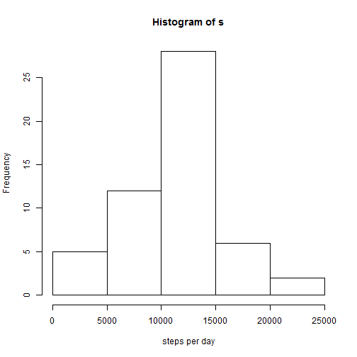
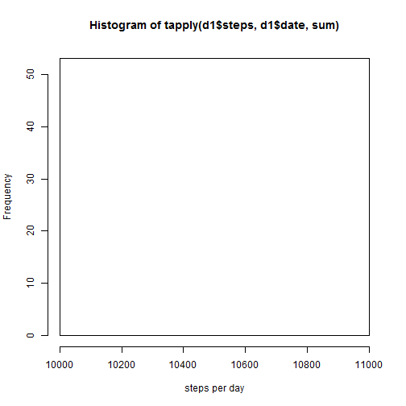
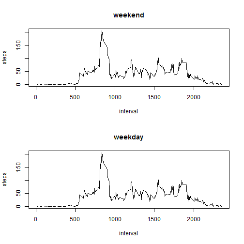

## Loading and preprocessing the data

```r
library(dplyr)
library(ggplot2)
Sys.setlocale(category = "LC_ALL", locale = "English_United States.1252")
```

```
## [1] "LC_COLLATE=English_United States.1252;LC_CTYPE=English_United States.1252;LC_MONETARY=English_United States.1252;LC_NUMERIC=C;LC_TIME=English_United States.1252"
```

```r
d<-read.table("activity.csv", header=TRUE, sep=",")
```


## What is mean total number of steps taken per day?

```r
i<-!is.na(d$steps)
d1<-d[i,]
s<-tapply(d1$steps, d1$date, sum, na.rm=TRUE)
hist(s, xlab="steps per day")
```

 

```r
mean(s, na.rm=TRUE)
```

```
## [1] 10766.19
```

```r
median(s, na.rm=TRUE)
```

```
## [1] 10765
```


## What is the average daily activity pattern?

```r
s1<-tapply(d$steps, d$interval, mean, na.rm=TRUE)
plot(names(s1), s1, xlab="interval", ylab="average steps", type='l')
```

 

```r
names(s1[s1==max(s1)])
```

```
## [1] "835"
```


## Imputing missing values

```r
sum(is.na(d$steps))
```

```
## [1] 2304
```

```r
d1<-d
d1[i,]$steps<-s1[as.character(d1[i,]$interval)]
hist(tapply(d1$steps, d1$date, sum), xlab="steps per day")
```

 

```r
mean(tapply(d1$steps, d1$date, sum), na.rm=TRUE)
```

```
## [1] 10766.19
```

```r
median(tapply(d1$steps, d1$date, sum), na.rm=TRUE)
```

```
## [1] 10766.19
```


## Are there differences in activity patterns between weekdays and weekends?

```r
d1<-mutate(d1, weekday=ifelse(weekdays(as.Date(date))=="Saturday" | weekdays(as.Date(date))=="Sunday", "weekend", "weekday"))
weekday<-tapply(d1[d1$weekday=="weekday",]$steps, d1[d1$weekday=="weekday",]$interval, mean, na.rm=TRUE)
weekend<-tapply(d1[d1$weekday=="weekend",]$steps, d1[d1$weekday=="weekend",]$interval, mean, na.rm=TRUE)
par(mfrow=c(2,1))
plot(names(weekend), weekend, type='l', xlab='interval', ylab='steps', main='weekend')
plot(names(weekday), weekday, type='l', xlab='interval', ylab='steps', main='weekday')
```

 
